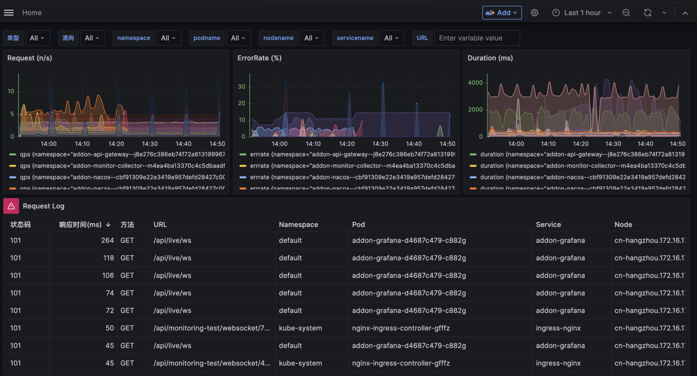
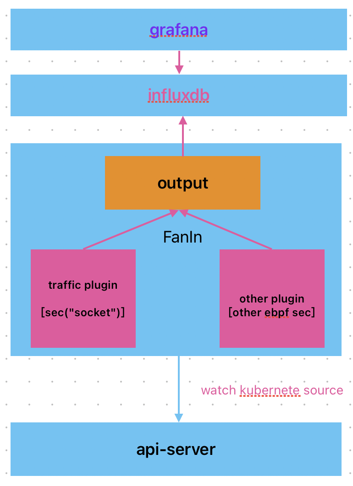

## 简介
kubebpf 是基于 ebpf 技术在 kubernetes 环境中实践可观测性建设的项目，提供对上层业务零侵扰的方式采集业务的调用日志，服务的 R.E.D 指标等可观测性数据，采用 influxdb 对数据进行持久化，采用 grafana 进行可视化，支持一键安装，可以快速将 ebpf 能力在你的 kubernetes 环境中进行落地。用于采集 ebpf 数据的 agent 支持扩展，你可以开发自己的 ebpf 程序来采集需要的数据，并且可以将数据上报的其他系统中。

## 功能特性
- [x] HTTP流量分析， 基于 BPF_PROG_TYPE_SOCKET_FILTER 分析每一次的 HTTP 流量，并且跟 kubernetes 元数据关联，还原每一个 pod 的 http 请求，包含入方向以及出方向。
- [x] R.E.D 指标统计，基于每个 pod 的 http 流量，计算出每个 pod 的 QPS，Error Rate，Latency等性能指标
- [ ] 全局拓扑，基于http流量，绘制出整个 kubernetes 环境中的调用拓扑。
- [ ] DNS 流量分析
- [ ] Mysql 流量分析
- [ ] 进程CPU火焰图
- ...更多
## 限制说明
- 操作系统内核版本 >= 3.19。
- Kubernetes版本 >= 1.16。
- 为了防止监控数据将磁盘打满，因此限制了influxdb的bucket数据保存时间为2天，可以根据具体情况进行调制配置。
- influxdb默认为单点不是，不建议生产环境使用，你可以根据自身场景进行扩展将数据接入自己的环境中。
## 架构

- **agent**  通过 daemonset 部署在每一个节点上，通过 ebpf 采集可观测性数据，并将其写入到 influxdb中。
- **influxdb** 持久化存储。
- **grafana** 可视化组件。
## 安装
安装目录
``` bash
cd install
```
由于grafana跟influxdb均需要持久化存储，因为需要事项确定存储的位置，通过配置文件来设置。
``` bash
vim config.ini

# 如下是一个配置实例, 需要事先在节点上创建出对应的目录
[global]
NAMESPACE=kubebpf
[influxdb]
;influxdb requires persistent storage. please create a directory on the node
INFLUXDB_HOST=cn-hangzhou-1
INFLUXDB_PV_PATH=/data/pv-kubebpf-influxdb
[grafana]
;grafana requires persistent storage. please create a directory on the node
GRAFANA_HOST=cn-hangzhou-1
GRAFANA_PV_PATH=/data/pv-kubebpf-grafana
```
最后执行安装脚本
``` bash
sh install.sh
```
#卸载
``` bash
sh uninstall.sh
```
## 开发
编译agent
```
make
```
#会生成agent的二进制文件,以及在target目录下生成每一个插件的 ebpf 编译之后 .o文件。
镜像构建
```bash
make image
```
grafana镜像构建
``` bash
# grafana 采用 provisioning 来配置 datasource 跟 dashboard, 对dashboard的修改需要重新构建grafana镜像。
cd  install/grafana/image
docker build .
```
## 参考或者使用的其他优秀项目
- [ebpf](https://ebpf.io/) a revolutionary Linux kernel technology.
- [cilium](https://github.com/cilium/cilium) eBPF-based Networking, Security, and Observability.
- [influxdb](https://github.com/influxdata/influxdb) Scalable datastore for metrics, events, and real-time analytics.
- [deepflow](https://github.com/deepflowio/deepflow) Application Observability using eBPF.
- [pixie](https://github.com/pixie-io/pixie) Instant Kubernetes-Native Application Observability.
- [grafana](https://github.com/grafana/grafana) The open and composable observability and data visualization platform.
- [telegraf](https://github.com/influxdata/telegraf) The plugin-driven server agent for collecting & reporting metrics.
- [owlk8s](https://github.com/est357/owlk8s) A K8s ClusterIP HTTP monitoring library based on eBPF.
## 许可证
KubeProber 遵循 Apache 2.0 许可证。有关详细信息请参见 [LICENSE](LICENSE) 文件。